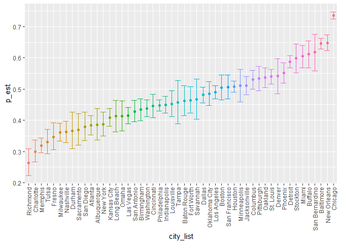
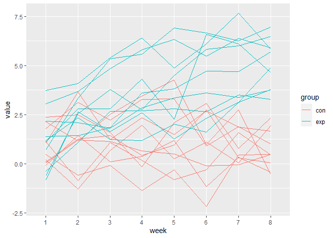
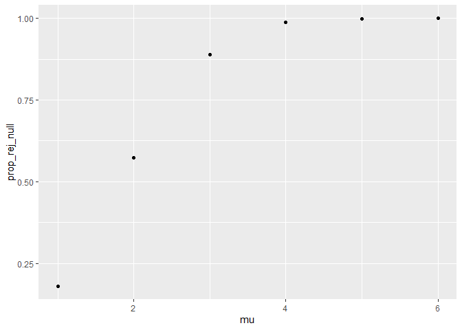
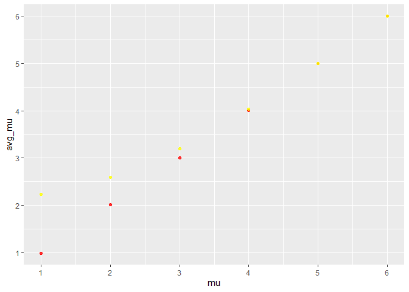

p8105_hw5_mc5503.Rmd
================
mc5503
2023-11-07

``` r
library(tidyverse)
```

    ## ── Attaching core tidyverse packages ──────────────────────── tidyverse 2.0.0 ──
    ## ✔ dplyr     1.1.3     ✔ readr     2.1.4
    ## ✔ forcats   1.0.0     ✔ stringr   1.5.0
    ## ✔ ggplot2   3.4.3     ✔ tibble    3.2.1
    ## ✔ lubridate 1.9.2     ✔ tidyr     1.3.0
    ## ✔ purrr     1.0.2     
    ## ── Conflicts ────────────────────────────────────────── tidyverse_conflicts() ──
    ## ✖ dplyr::filter() masks stats::filter()
    ## ✖ dplyr::lag()    masks stats::lag()
    ## ℹ Use the conflicted package (<http://conflicted.r-lib.org/>) to force all conflicts to become errors

``` r
library(purrr)
```

# Problem 1

## data operations

``` r
data1=read_csv("data/homicide-data.csv")|>janitor::clean_names()
```

    ## Rows: 52179 Columns: 12
    ## ── Column specification ────────────────────────────────────────────────────────
    ## Delimiter: ","
    ## chr (9): uid, victim_last, victim_first, victim_race, victim_age, victim_sex...
    ## dbl (3): reported_date, lat, lon
    ## 
    ## ℹ Use `spec()` to retrieve the full column specification for this data.
    ## ℹ Specify the column types or set `show_col_types = FALSE` to quiet this message.

``` r
str(data1)
```

    ## spc_tbl_ [52,179 × 12] (S3: spec_tbl_df/tbl_df/tbl/data.frame)
    ##  $ uid          : chr [1:52179] "Alb-000001" "Alb-000002" "Alb-000003" "Alb-000004" ...
    ##  $ reported_date: num [1:52179] 20100504 20100216 20100601 20100101 20100102 ...
    ##  $ victim_last  : chr [1:52179] "GARCIA" "MONTOYA" "SATTERFIELD" "MENDIOLA" ...
    ##  $ victim_first : chr [1:52179] "JUAN" "CAMERON" "VIVIANA" "CARLOS" ...
    ##  $ victim_race  : chr [1:52179] "Hispanic" "Hispanic" "White" "Hispanic" ...
    ##  $ victim_age   : chr [1:52179] "78" "17" "15" "32" ...
    ##  $ victim_sex   : chr [1:52179] "Male" "Male" "Female" "Male" ...
    ##  $ city         : chr [1:52179] "Albuquerque" "Albuquerque" "Albuquerque" "Albuquerque" ...
    ##  $ state        : chr [1:52179] "NM" "NM" "NM" "NM" ...
    ##  $ lat          : num [1:52179] 35.1 35.1 35.1 35.1 35.1 ...
    ##  $ lon          : num [1:52179] -107 -107 -107 -107 -107 ...
    ##  $ disposition  : chr [1:52179] "Closed without arrest" "Closed by arrest" "Closed without arrest" "Closed by arrest" ...
    ##  - attr(*, "spec")=
    ##   .. cols(
    ##   ..   uid = col_character(),
    ##   ..   reported_date = col_double(),
    ##   ..   victim_last = col_character(),
    ##   ..   victim_first = col_character(),
    ##   ..   victim_race = col_character(),
    ##   ..   victim_age = col_character(),
    ##   ..   victim_sex = col_character(),
    ##   ..   city = col_character(),
    ##   ..   state = col_character(),
    ##   ..   lat = col_double(),
    ##   ..   lon = col_double(),
    ##   ..   disposition = col_character()
    ##   .. )
    ##  - attr(*, "problems")=<externalptr>

``` r
time_range=range(data1|>pull(reported_date))
```

There are 52179 observations from 2007-01-01 to 2015-11-10. There are 12
variables, containing the time, location of each homicide and
demographic characteristics of victim. There are total 50 cities
included in the data.

## calculate for Baltimore

``` r
data1=data1|>mutate(city_state=paste(city,state,sep = ","))

n_obs=nrow(data1|>filter(city=='Baltimore'))

n_arrest=nrow(data1|>filter(city=='Baltimore'& disposition!="Closed by arrest"))

result=prop.test(x=n_arrest,n=n_obs)

p_est=broom::tidy(result)|>pull(estimate)

conf_low=broom::tidy(result)|>pull(conf.low)

conf_high=broom::tidy(result)|>pull(conf.high)

p_est
```

    ##         p 
    ## 0.6455607

``` r
conf_low
```

    ## [1] 0.6275625

``` r
conf_high
```

    ## [1] 0.6631599

The proportion of unsolved (unarrested) homicide in Baltimore is
0.6455607, and the CI is \[0.6275625, 0.6631599\].

## calculate for all cities

``` r
prop_f=function(city_name)
{
  n_obs=nrow(data1|>filter(city==city_name))

  n_arrest=nrow(data1|>filter(city==city_name & disposition!="Closed by arrest"))

  result=prop.test(x=n_arrest,n=n_obs)

  p_est=broom::tidy(result)|>pull(estimate)

  conf_low=broom::tidy(result)|>pull(conf.low)

  conf_high=broom::tidy(result)|>pull(conf.high)
  
  tibble(p_est,conf_low,conf_high)
}

#prop_f("Baltimore")

city_list=unique(data1|>pull(city))

output = vector("list", length = length(city_list))

output=map(city_list,prop_f)

#data_nest=nest(data1, data = c(-city))

prop_results=tibble(city_list,output)|>unnest(cols = output)
```

## plots

``` r
prop_results|>
  mutate(city_list=forcats::fct_reorder(city_list,p_est))|>
  ggplot(aes(x=city_list,y=p_est,ymin=conf_low,ymax=conf_high,color=city_list))+
  geom_point()+
  geom_errorbar()+
  theme(axis.text.x = element_text(angle = 90, hjust = 1, vjust = .5))+
  theme(legend.position="none")
```

<!-- -->

# Problem 2

## tidy the dataset

``` r
file_names=list.files("data/data_long")

setwd("data/data_long")

data2=tibble(
  file_names,
  results=map(file_names,read_csv)
)|>unnest()|>
  separate(file_names,sep = "\\.",c("subject","csv"))|>
  pivot_longer(week_1:week_8,
               names_to = "time",
               values_to = "value")|>
  separate(time,c("unit","week"))|>
  select(subject,week,value)

(data2)
```

    ## # A tibble: 160 × 3
    ##    subject week  value
    ##    <chr>   <chr> <dbl>
    ##  1 con_01  1      0.2 
    ##  2 con_01  2     -1.31
    ##  3 con_01  3      0.66
    ##  4 con_01  4      1.96
    ##  5 con_01  5      0.23
    ##  6 con_01  6      1.09
    ##  7 con_01  7      0.05
    ##  8 con_01  8      1.94
    ##  9 con_02  1      1.13
    ## 10 con_02  2     -0.88
    ## # ℹ 150 more rows

## spaghetti plot

``` r
data2|>
  mutate(group=substr(subject,1,3))|>
  ggplot(aes(x=week,y=value,group=subject))+
  geom_line(aes(color=group))
```

<!-- -->

In general, the control arm have lower values than the experimental arm.
The the difference is the most significant in the 8th week. The values
of experimental group have an increasing trend over time.

# Problem 3

## mean=0

``` r
n=30
sigma=5
mu=0
data_list=vector("list",length=5000)

for (i in 1:5000){
  data_list[[i]]=rnorm(n,mu,sigma)
}

get_results=function(data){
  broom::tidy(t.test(data))
}

data3=tibble(
  data=data_list,
  results=map(data_list,get_results)
)|>
  unnest(cols = results)|>
  select(data,estimate,p.value)
```

## repeat for other mean

``` r
df_results=function(mu,sigma=5,size=30)
{ 
  data_list=vector("list",length=5000)
  for (i in 1:5000)
  {
    data_list[[i]]=rnorm(n=size,mean =mu,sd=sigma)
  }
  
  tibble(
  data=data_list,
  results=map(data_list,get_results)
)|>
  unnest(cols = results)|>
  select(data,estimate,p.value)
}

data_all=tibble(
  mu=c(1,2,3,4,5,6),
  res=map(mu,df_results)
)
```

``` r
prop_rej=function(df){
  nrow(df|>filter(p.value<0.05))/5000
}

data_all|>mutate(prop_rej_null=map(res,prop_rej))|>
  unnest(prop_rej_null)|>
  ggplot(aes(x=mu,y=prop_rej_null))+
  geom_point()
```

<!-- -->

As the effect size increase, the power of the test increase and
gradually approaches 1.

``` r
get_avg_mu=function(df){
  mean(df|>pull(estimate))
}

p1=data_all|>mutate(avg_mu=map(res,get_avg_mu))|>
  unnest(avg_mu)|>
  ggplot(aes(x=mu,y=avg_mu))+
  geom_point(color="red",alpha=0.8)+
  scale_x_continuous(breaks = c(1,2,3,4,5,6))+
  scale_y_continuous(breaks = c(1,2,3,4,5,6))

get_avg_mu_rej=function(df){
  mean(df|>filter(p.value<0.05)|>pull(estimate))
}

data_p2=data_all|>mutate(avg_mu_rej=map(res,get_avg_mu_rej))|>
  unnest(avg_mu_rej)

p1+geom_point(data=data_p2,aes(x = mu, y = avg_mu_rej),color="yellow",alpha=0.8)
```

<!-- -->

The sample average of μ_hat across tests for which the null is rejected
is not equal to the true value of μ when true mean is small. This is
because the sampling distribution of mean follows normal distribution
with mean equals to true value of μ, but omitting the samples which the
null isn’t rejected will change the sampling distribution.
